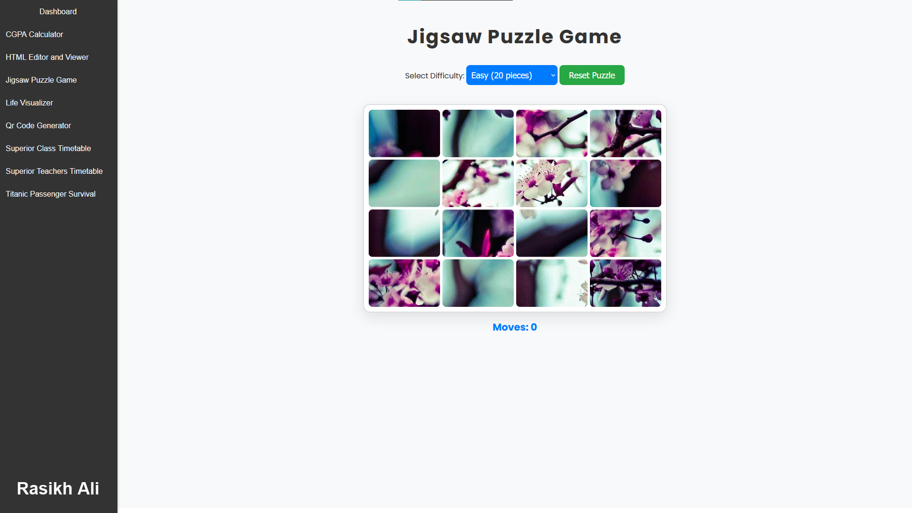

# Jigsaw Puzzle Game

This project is a fun and interactive jigsaw puzzle game built with Flask and vanilla JavaScript. Users can select different difficulty levels to play with varying numbers of puzzle pieces, and the game dynamically generates a new puzzle each time.

## Features

- **Difficulty Levels**: Choose from easy (20 pieces), medium (50 pieces), or hard (90 pieces).
- **Random Images**: The game fetches random images from Lorem Picsum for the puzzles.
- **Puzzle Mechanics**: Drag and swap puzzle pieces to solve the jigsaw puzzle.
- **Moves Counter**: Tracks the number of moves taken to complete the puzzle.
- **Responsive Design**: The game is designed to work well on both desktop and mobile devices.

## Live Demo

You can try out the Jigsaw Puzzle Game live at [rasikhali.marveloussoft.tech](https://rasikhali.marveloussoft.tech).

## Installation

To run this project locally, follow these steps:

1. **Clone the Repository**:
    ```bash
    git clone https://github.com/RasikhAli/Jigsaw-Puzzle-Game.git
    ```
2. **Navigate to the Project Directory**:
    ```bash
    cd Jigsaw-Puzzle-Game
    ```
3. **Install Dependencies**:
    Ensure you have Flask installed. If not, you can install it using:
    ```bash
    pip install Flask
    ```
4. **Run the Application**:
    ```bash
    python app.py
    ```
    The application will start running on `http://127.0.0.1:5000/`.

## Screenshot


## Usage

- Open the application in your web browser.
- Select the desired difficulty level from the dropdown menu.
- Click "Reset Puzzle" to generate a new puzzle with the selected difficulty.
- Solve the puzzle by clicking and swapping pieces.

## Contributing

Feel free to fork the repository and submit pull requests. Contributions and suggestions are always welcome.

---

Thank you for checking out the Jigsaw Puzzle Game! Enjoy playing and have fun solving puzzles!
